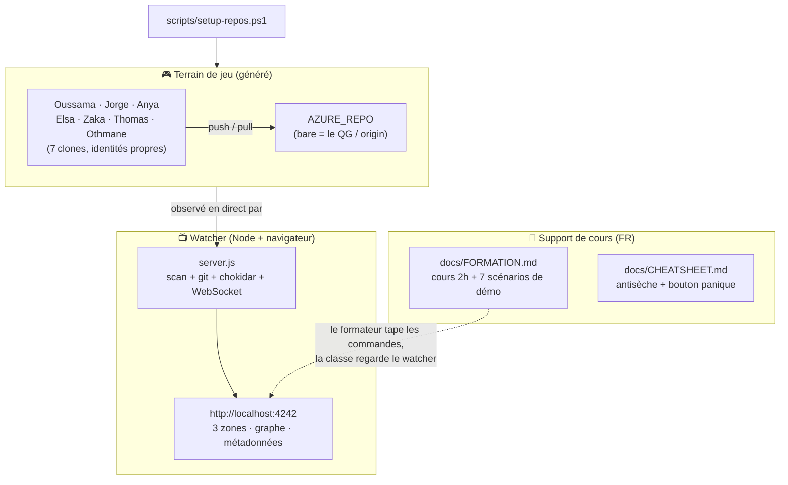

# 🕹️ Formation Git — Kit complet (démo live + tableau de bord visuel)

Tout le matériel pour animer une **formation Git de 2 h** en français, pensée pour des
**actuaires qui débutent en code** : métaphores *voyage dans le temps* + *jeu vidéo*, un
terrain de jeu multi-dépôts réaliste, et un **tableau de bord web temps réel** qui rend
visible ce que Git fait d'habitude en coulisses.

> Ce fichier (`README.md`) est le **document de processus** : il explique comment toutes
> les pièces s'emboîtent et comment tout lancer. Le **support de cours** est dans
> [`docs/FORMATION.md`](docs/FORMATION.md) (version riche), [`docs/FORMATION-MINI.md`](docs/FORMATION-MINI.md)
> (version projection : diagrammes + tableaux, 1 scénario par section) et l'antisèche dans
> [`docs/CHEATSHEET.md`](docs/CHEATSHEET.md). Pour **animer** la session (déroulé, sondages Teams,
> storytelling des scénarios) : [`docs/PRESENTATION.md`](docs/PRESENTATION.md).

---

## 1. Les 3 composants (et comment ils s'articulent)



- **Tu** (le formateur) tapes les commandes Git de [`docs/FORMATION.md`](docs/FORMATION.md) dans les dépôts du terrain de jeu.
- Le **watcher** observe ce dossier et **anime** en direct l'effet de chaque commande (fichier qui passe de l'établi au sas, nouveau commit dans le graphe, badges ahead/behind…).
- La classe **regarde l'écran** ; à la fin, ils pratiquent entre eux sur un vrai dépôt Azure (hors de ce kit).

---

## 2. Prérequis

| Outil | Version testée | Vérifier |
|---|---|---|
| Git | 2.43+ | `git --version` |
| Node.js | 18+ (testé sur 25) | `node --version` |
| PowerShell | Windows | (déjà là) |

---

## 3. Démarrage rapide (3 étapes)

```powershell
# 1) Construire le terrain de jeu (bare AZURE_REPO + 7 clones + historique de démo)
powershell -ExecutionPolicy Bypass -File scripts\setup-repos.ps1

# 2) Installer et lancer le tableau de bord
cd watcher
npm install
node server.js ../playground

# 3) Ouvrir le navigateur
#    http://localhost:4242
```

> 💡 Astuce de démo : mets le **navigateur (watcher)** et un **terminal** côte à côte.
> Tu tapes à gauche, la magie opère à droite.

Pour **tester** que tout marche (sans rien casser) :

```powershell
cd watcher
npm test            # 21 assertions sur le scanner + l'inspecteur
npm run simulate    # joue une petite histoire git en direct (regarde le watcher !)
```

---

## 4. Le terrain de jeu (`playground/`)

Généré par `scripts/setup-repos.ps1`. **Re-jouable** : relancer le script efface et
recrée tout (`scripts/teardown.ps1` pour juste supprimer).

| Dépôt | Type | État au démarrage (pour un dashboard vivant) |
|---|---|---|
| **AZURE_REPO** | **bare** (QG) | `main` + `feature/calcul-prime`, reçoit les push |
| Oussama | normal | propre, **en retard de 1** (un `git pull` suffit) |
| Jorge | normal | à jour, vient de **pousser** le taux 0.055 |
| Anya | normal | **divergent** (ahead 1 / behind 1) → `git pull` = **paradoxe** (conflit prêt) |
| Elsa | normal | un changement **dans le sas** (staged, pas commité) |
| Zaka | normal | **établi sale** (modif non préparée + fichier non suivi) |
| Thomas | normal | sur la branche **`feature/calcul-prime`** |
| Othmane | normal | un **stash** en poche, établi propre |

Chaque clone a sa propre identité (`user.name` / `user.email` = `<prénom>@formation.git`),
donc le graphe montre **qui a fait quoi**.

> Le projet versionné reste petit mais **vivant** : ~19 commits **signés par les 7 personnes**
> (étalés sur ~3 semaines → des dates réalistes « il y a X jours »), une **fusion** (export CSV),
> **5 branches** (`main`, `feature/calcul-prime`, `feature/export-csv` *fusionnée*, `fix/arrondi`,
> `experimentation/modele-2026`) et **2 tags** (`v0.1`, `v1.0`). Petite arborescence :
> `prime.py · parametres.py · utils.py · export.py · CHANGELOG.md · data/baremes.csv · tests/ · docs/`.
> Assez pour un graphe riche, sans noyer les débutants sous du code.

---

## 5. Comment marche le watcher (architecture)

```
watcher/
├─ server.js            # HTTP + WebSocket + chokidar (orchestration)
├─ lib/
│  ├─ scanner.js        # trouve les dépôts ; classe normal vs bare (système de fichiers)
│  ├─ inspector.js      # construit le "snapshot" d'un dépôt via la CLI git
│  └─ git.js            # wrapper git (execFile) : -C pour normal, --git-dir pour bare
├─ public/              # l'UI (sans build : HTML/CSS/JS vanilla)
│  ├─ index.html · style.css
│  ├─ app.js            # WebSocket + rendu (sidebar, 3 zones, métadonnées)
│  └─ graph.js          # graphe de commits en SVG (algorithme de "lanes")
└─ test/
   ├─ inspect.test.js   # assertions automatiques
   └─ simulate.js       # simulateur d'activité (démo/observation)
```

**Boucle temps réel :**
1. `scanner` liste les dépôts sous le dossier observé (profondeur bornée, ignore `node_modules`/`objects`).
2. `inspector` lance des commandes git (`status --porcelain=v2`, `for-each-ref`, `log --all`, `stash list`…) et en fait un objet JSON.
3. `chokidar` surveille les fichiers **et** les internes `.git` (HEAD, index, refs, logs) → à tout changement, on ré-inspecte le dépôt concerné (anti-rebond ~180 ms).
4. Un **poll de sécurité** (toutes les 3 s) ré-inspecte tout au cas où un événement fichier serait manqué.
5. On ne diffuse par **WebSocket** que si le snapshot a **réellement** changé (comparaison de hash) → **zéro scintillement**.

**Indépendant de la configuration** : le watcher ne sait rien des noms Oussama/Jorge/… Il
prend **un dossier** en argument, y **découvre** les dépôts, et **déduit** lesquels sont
bare vs normaux. Pointe-le sur n'importe quel dossier :

```powershell
node server.js "C:\chemin\vers\un\autre\dossier"
# ou
$env:WATCH_DIR="C:\..."; node server.js
```

---

## 6. Lire le tableau de bord

- **Barre du haut** : dossier observé, **ticker** d'activité (⚡ qui a touché quel fichier), pastille de connexion.
- **Sidebar (gauche)** : une carte par dépôt — avatar/identité, badge **QG (bare)** ou **local**, branche courante, compteurs (✚ staged, ● modifié, ? non-suivi, ⚠ conflit, ↑ahead / ↓behind, ⊟ stash).
- **Panneau (droite)** quand on sélectionne un dépôt :
  - **Les 3 zones (+ QG)** : 🛠️ Établi → 📦 Sas → 💾 Dépôt → ☁️ QG, avec les flèches `git add` / `git commit` / `git push`. **C'est la matérialisation du modèle mental du cours.**
  - **Métadonnées** : identité, HEAD, branches (avec ahead/behind), tags, stashes, remotes.
  - **Graphe temporel** : tous les commits / toutes les branches en colonnes colorées (= timelines), ★ = HEAD.

---

## 7. Déroulé suggéré (2 h)

| ⏱️ | Section (FORMATION.md) | Sur le watcher |
|---|---|---|
| 0–10 | Pourquoi Git · Pierre de Rosette | Vue d'ensemble des 8 dépôts |
| 10–25 | **Les 3 zones** · identité · bare | Zaka (établi sale), Elsa (sas), badge bare d'AZURE_REPO |
| 25–45 | Cycle `status → add → commit` · log | Scénario (a) et (b) en live |
| 45–65 | Voyager sans peur · reset/revert/reflog | Scénario (f) « j'ai tout cassé » |
| 65–85 | Branches · merge · **conflit** | Thomas (feature) ; provoquer Anya `git pull` → paradoxe |
| 85–100 | QG : fetch/pull/push · ahead-behind | Oussama `pull`, push → AZURE_REPO grandit |
| 100–110 | diffs · stash · .gitignore · alias · GitLens | Othmane (stash) ; GitLens dans VS Code |
| 110–120 | Récap · lancement de l'exercice Azure | Cheatsheet + bouton panique |

> Les **7 scénarios pas-à-pas** (avec « 👀 ce qu'on doit voir dans le watcher ») sont en
> annexe de [`docs/FORMATION.md`](docs/FORMATION.md#17--annexe--scénarios-de-démo-pas-à-pas).
>
> 🔀 **Rebase (§8)** est un bonus « pour aller plus loin » : à caser dans le créneau 100–110
> si le rythme le permet (idéal sur la branche de Thomas / une branche bien divergente pour
> voir le graphe se redresser), sinon à pointer dans la cheatsheet.

---

## 8. Réinitialiser entre deux essais

```powershell
# Tout remettre à l'état de départ (après avoir bidouillé pendant une répét) :
powershell -ExecutionPolicy Bypass -File scripts\setup-repos.ps1

# Ou juste supprimer le terrain de jeu :
powershell -ExecutionPolicy Bypass -File scripts\teardown.ps1
```

Le watcher détecte la disparition/réapparition des dépôts tout seul (rescan automatique).

---

## 9. Dépannage

| Souci | Cause / solution |
|---|---|
| `cannot use bare repository … safe.bareRepository is 'explicit'` | Config git de sécurité. **Déjà géré** : le watcher attaque les dépôts bare avec `--git-dir`. (Si tu scriptes toi-même, fais pareil.) |
| Le port 4242 est pris | `set PORT=4300` (cmd) / `$env:PORT="4300"` (PowerShell) puis relancer. |
| Rien ne bouge en direct (lecteur réseau, VM) | Lancer avec `$env:WATCH_FS_POLLING="1"` pour forcer le polling fichiers. |
| Fausses « modifs » de fins de ligne sous Windows | `setup-repos.ps1` force déjà `core.autocrlf=false` au clone. |
| Le `push` du simulateur est « rejected » | Normal si le dépôt est *behind* : le simulateur fait un `pull --ff-only` d'abord ; sinon c'est un excellent prétexte à démo « pull avant push ». |
| **La page s'ouvre vite mais reste vide puis se remplit lentement** | Inspection `git` lente : sur un PC pro, l'**antivirus/EDR scanne chaque `git.exe`**. La page est servie tout de suite ; les dépôts apparaissent **un par un**. Regarde le log `git … un spawn a pris Xms` (si X > 1500 ms, c'est ça). Voir §9 bis pour alléger. |
| **Le navigateur « recharge » sans afficher l'appli** | Souvent le **WebSocket bloqué** (proxy/sécurité). Le client bascule **tout seul en HTTP** (badge « HTTP (sans live) ») ; l'appli reste utilisable. Console (F12) : `[watcher] WebSocket fermé…`. |

---

## 9 bis. 🩺 Monitorer & régler (surtout PC pro / machine lente)

Le serveur logue tout, **horodaté** (secondes depuis le démarrage). Détail complet :

```powershell
$env:WATCH_DEBUG="1"; node server.js ../playground
```

À lire au démarrage :

- `✔ Serveur prêt → http://localhost:4242` apparaît **immédiatement** — la page se charge sans attendre l'inspection (les dépôts arrivent ensuite).
- `git … un spawn a pris Xms` = **auto-diagnostic**. `X` petit (< 200 ms) = sain ; `X` grand (> 1500 ms) = antivirus/EDR qui ralentit chaque `git` (un avertissement s'affiche).
- `inspecté <dépôt> en Yms` = temps par dépôt (≈ 6 appels `git` chacun).
- `Inspection initiale : N dépôt(s) en Wms (… appels git, … lents, … timeouts)` = le bilan. `W` (temps réel) est bien plus petit que le cumul git car les dépôts sont inspectés **en parallèle** (`WATCH_CONCURRENCY`, défaut 4).
- `poll: 0/8 inspectés (reste sauté, .git inchangé)` = **inspection paresseuse** : tant que rien ne bouge, le poll ne lance **aucun** `git` (juste des `stat`, quasi gratuits). Tu ne dois voir des `git lent` **que** quand tu tapes une vraie commande (chokidar ré-inspecte alors le seul dépôt concerné).

Côté **navigateur** : ouvre la console (F12) → lignes `[watcher]` (WebSocket / bascule HTTP). Et `http://localhost:4242/api/health` renvoie un JSON avec les compteurs `git`.

| Variable d'env | Défaut | Effet |
|---|---|---|
| `WATCH_DEBUG` | `0` | `1` = logs détaillés (appels git lents, broadcasts, polls) |
| `WATCH_CONCURRENCY` | `4` | dépôts inspectés **en parallèle** au démarrage (les spawns git lents se chevauchent) |
| `WATCH_POLL_MS` | `5000` | filet de sécurité **paresseux** (saute git si `.git` inchangé). `0` = désactivé |
| `WATCH_RESCAN_MS` | `15000` | re-scan ajout/suppression de dépôts (paresseux aussi) |
| `WATCH_FS_POLLING` | `0` | `1` = chokidar en polling (lecteurs réseau / VM) |
| `WATCH_LOG_LIMIT` | `300` | nb de commits chargés pour le graphe (baisser = inspection plus rapide) |
| `WATCH_GIT_TIMEOUT_MS` | `20000` | tue un `git` qui bloque trop longtemps |
| `PORT` | `4242` | port HTTP |

> 💡 **Depuis l'inspection paresseuse, au repos le watcher ne lance plus aucun `git`** — inutile de désactiver le poll. Le seul coût restant est l'inspection d'un dépôt **quand il change vraiment**. Pour l'accélérer sur PC très lent :
> ```powershell
> $env:WATCH_LOG_LIMIT="120"; $env:WATCH_CONCURRENCY="6"; node server.js ../playground
> ```

---

## 10. Arborescence

```
git_form/
├─ README.md                 ← tu es ici (document de processus)
├─ docs/
│  ├─ FORMATION.md           ← support de cours complet (FR, document vivant)
│  ├─ FORMATION-MINI.md      ← version projection (diagrammes + tableaux, 1 scénario/section)
│  ├─ PRESENTATION.md        ← guide d'animation (déroulé, sondages Teams, storytelling)
│  └─ CHEATSHEET.md          ← antisèche imprimable (FR)
├─ scripts/
│  ├─ setup-repos.ps1        ← génère playground/ (bare + 7 clones + démo)
│  └─ teardown.ps1
├─ watcher/                  ← tableau de bord (voir §5)
└─ playground/               ← généré (non versionné)
```

---

## 11. Pour itérer

C'est un **point de départ** conçu pour être ajusté après tes tests. Quelques pistes faciles :
- Le **thème visuel** est dans `watcher/public/style.css` (variables de couleur en haut).
- Les **données collectées** par dépôt : `watcher/lib/inspector.js`.
- Les **états de départ** des dépôts : la section « Mise en scène » de `scripts/setup-repos.ps1`.
- Le **support de cours** est un document vivant : enrichis `docs/FORMATION.md` au fil de tes répétitions.

Dis-moi ce que tu veux voir différemment dans le watcher (zones, graphe, animations, infos
en plus) et on l'ajuste.
