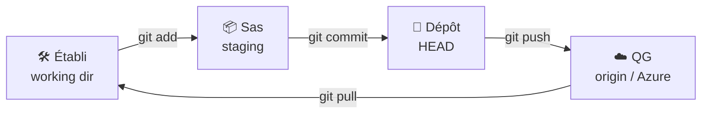
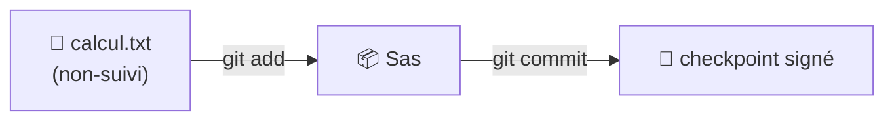
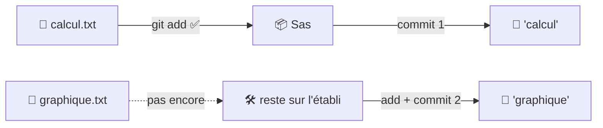
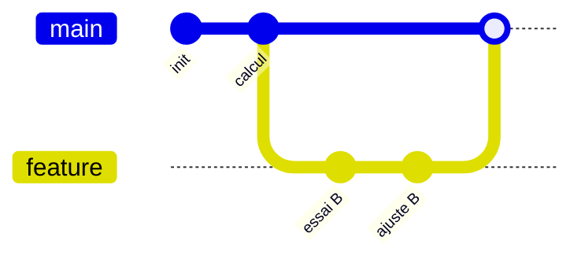
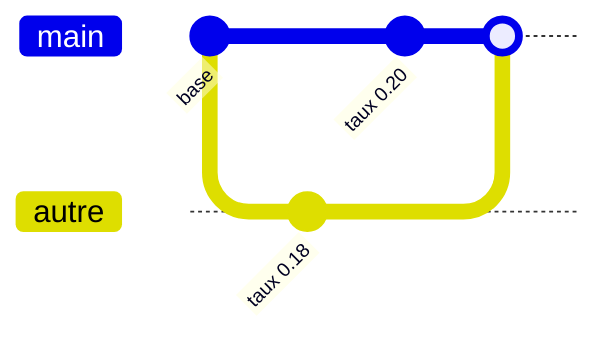
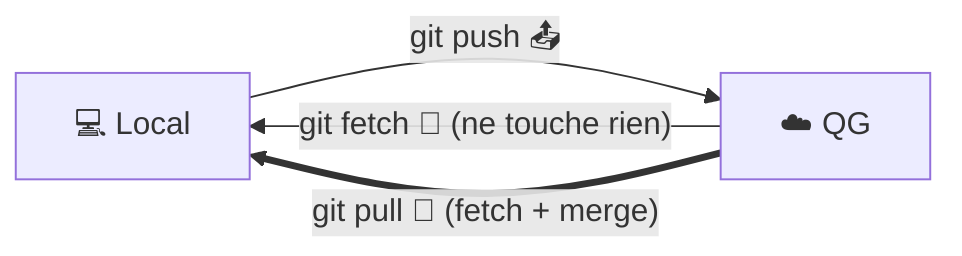
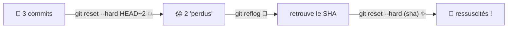
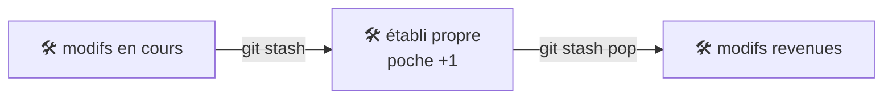
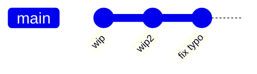
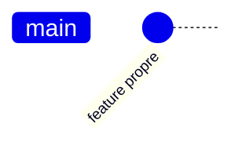

# 🕹️ Git — Mémo Express (version projection)

> Diagrammes + tableaux. Le texte, c'est **toi** qui le dis. 🎤 · Version riche → [`FORMATION.md`](./FORMATION.md)

---

## 🎲 Les 3 règles du jeu

| | La règle |
|:-:|---|
| 🛟 | **N'aie pas peur de casser** : avec Git, presque tout se récupère. |
| 🧭 | **`git status` avant ET après** chaque commande. Toujours. |
| 💾 | **Un commit est sacré** : figé, daté, signé à ton nom — et on en fait **souvent**. |

## ⚡ Les 6 verbes (EN ↔ FR)

| Anglais | Français |
|---|---|
| **fetch** | télécharger (reconnaissance) |
| **pull** | télécharger **+** synchroniser |
| **push** | envoyer / téléverser |
| **commit** | sauvegarder (checkpoint) |
| **add** | préparer (mettre au panier) |
| **merge** | fusionner |

## 🗺️ La carte : 3 zones + le QG



## 🧰 Commandes — 🖥️ Local vs ☁️ Distant

| 🖥️ LOCAL (ta machine) | ☁️ DISTANT (le QG / Azure) |
|---|---|
| `git init` — créer un dépôt | `git clone <url>` — copier le QG |
| `git status` — la boussole 🧭 | `git remote -v` — voir le QG |
| `git add` — préparer | `git fetch` — télécharger (recon) |
| `git commit -m` — checkpoint | `git pull` — télécharger + fusionner |
| `git log --oneline --graph --all` | `git push` — envoyer |
| `git switch -c` / `git switch` — branches | `git push -u origin main` — 1re fois |
| `git merge` — fusionner | |
| `git restore` / `git reset` — annuler | |
| `git stash` — poche · `git rebase -i` — nettoyer | |

## 🛡️ Règles d'or par commande

| Commande | ⚠️ La règle |
|---|---|
| `git status` | à lire **avant ET après** tout — la boussole 🧭 |
| `git add .` | relis `git status` juste après (embarque **tout**, même l'indésirable) |
| `git commit --amend` | seulement si **pas encore poussé** |
| `git restore <f>` | **jette** les modifs non commitées du fichier (irréversible) |
| `git reset --hard` | peut **écraser l'établi** ; les commits, eux, se récupèrent (`reflog`) |
| `git rebase` | **jamais** sur des commits **déjà poussés** (on réécrit l'histoire) |
| `git push` | **`pull` avant `push`**, toujours |
| `git merge` / conflit | en cas de doute : `git merge --abort` (ou `git rebase --abort`) |

---

# 🎬 Scénarios

## (a) 🥇 Premier checkpoint



| Commande | 👀 Watcher |
|---|---|
| `git status` | fichier "non-suivi" (établi) |
| `git add calcul.txt` | saute Établi → Sas |
| `git commit -m "..."` | nouveau nœud signé ; sas vidé |

## (b) 🧺 Staging sélectif



| Commande | 👀 Watcher |
|---|---|
| 2 fichiers modifiés | 2 modifs sur l'établi |
| `git add calcul.txt` | seul calcul.txt au sas |
| `git commit -m "calcul"` | checkpoint #1 |
| `git add graphique.txt && git commit -m "graphique"` | checkpoint #2 |

## (c) 🌌 Branche + merge



| Commande | 👀 Watcher |
|---|---|
| `git switch -c feature` | nouvelle colonne ; HEAD dessus |
| `git commit -am "..."` | la branche avance |
| `git switch main` | HEAD revient sur main |
| `git merge feature` | les timelines se rejoignent |

## (d) ⚡ Conflit (paradoxe temporel)



```text
<<<<<<< HEAD
taux = 0.20          ← ta version
=======
taux = 0.18          ← la version d'en face
>>>>>>> autre
```

| Commande | 👀 Watcher |
|---|---|
| `git merge autre` | 💥 conflit ; 2 branches divergentes |
| `git status` | "both modified" |
| *(éditer : garder la bonne valeur, supprimer les 3 balises)* | — |
| `git add <fichier>` puis `git commit` | nœud de fusion |
| 🆘 `git merge --abort` | retour avant le merge |

## (e) 🛰️ Push / fetch / pull



| | Commande | 👀 Watcher |
|---|---|---|
| ☁️ | `git pull` | reçoit le "behind", graphe rattrape |
| 🖥️ | `git commit -am "..."` | "ahead by 1" |
| ☁️ | `git push` | le QG (AZURE_REPO) grandit |
| ☁️ | `git fetch` | recon, **sans** toucher l'établi |

## (f) 🆘 « J'ai tout cassé » → reflog



| Commande | 👀 Watcher |
|---|---|
| `git reset --hard HEAD~2` | le graphe recule |
| `git reflog` | le SHA "perdu" est là |
| `git reset --hard <sha>` | les commits réapparaissent |

## (g) 🎒 Stash (poche dimensionnelle)



| Commande | 👀 Watcher |
|---|---|
| `git stash` | établi nettoyé ; compteur stash +1 |
| `git stash list` | contenu de la poche |
| `git stash pop` | modifs reviennent ; compteur −1 |

## (h) 🔀 Rebase interactif (nettoyer avant de pousser)



```text
git rebase -i HEAD~3   →   pick   wip
                           squash wip2
                           squash fix typo
```



| Commande | 👀 Watcher |
|---|---|
| `git rebase -i HEAD~3` | la "table de montage" s'ouvre |
| `pick` + `squash` + `squash`, sauver/fermer | 3 nœuds → **1** propre |
| 🆘 `git rebase --abort` | retour avant le rebase |

> ⚠️ Jamais sur des commits **déjà poussés** (on réécrit l'histoire des autres).

---

# 🧩 Annexe — tableaux express

## ⚙️ Config (une seule fois)

```bash
git config --global user.name  "Prénom"
git config --global user.email "prenom@formation.git"
git config --global core.editor "code --wait"     # anti-Vim
git config --global init.defaultBranch main
```

> Coincé dans **Vim** ? `Échap` puis `:wq` (sauver) ou `:q!` (annuler).

## ⏪ `reset` — qu'est-ce qui bouge ?

| mode | historique | sas | établi |
|---|---|---|---|
| `--soft` | ⏪ | gardé | gardé |
| `--mixed` *(défaut)* | ⏪ | vidé | gardé |
| `--hard` | ⏪ | vidé | ⚠️ écrasé |

## ⚡ Alias (copier-coller)

```bash
git config --global alias.st status
git config --global alias.lg "log --oneline --graph --all --decorate"
git config --global alias.unstage "restore --staged"
git config --global alias.last "log -1 HEAD"
```

## 🚫 `.gitignore`

```gitignore
*.xlsx          # gros fichiers
.env            # secrets
__pycache__/    # fichiers générés
```

## 🔮 GitLens (extension VS Code)

| Fonction | Montre |
|---|---|
| Blame en ligne | qui / quand / pourquoi chaque ligne |
| Commit Graph | graphe interactif des branches |
| File History | toutes les versions d'un fichier |

## 🆘 Bouton panique

| « J'ai… » | Tape ça |
|---|---|
| annuler une modif (pas commitée) | `git restore <f>` |
| commité trop tôt | `git reset --soft HEAD~1` |
| déstager un fichier | `git restore --staged <f>` |
| perdu un commit | `git reflog` → `git reset --hard <sha>` |
| merge / rebase en vrille | `git merge --abort` / `git rebase --abort` |
| push refusé (rejected) | `git pull` puis `git push` |

---

> 🧭 **`git status` avant et après, toujours.** · 🛟 **Avec Git, presque tout se récupère.**
