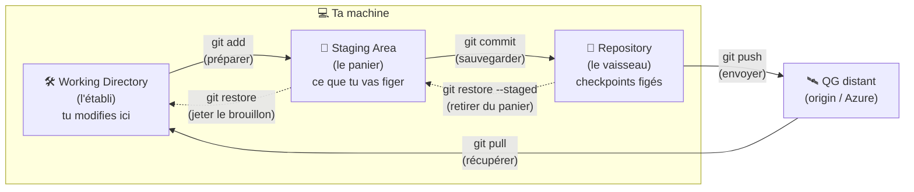
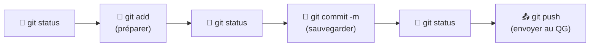
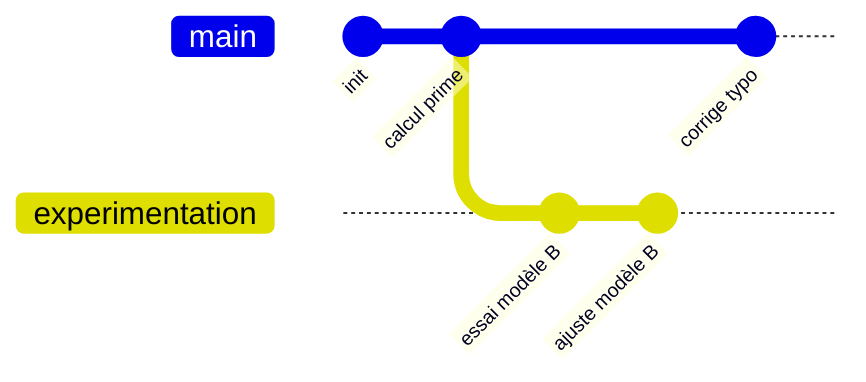
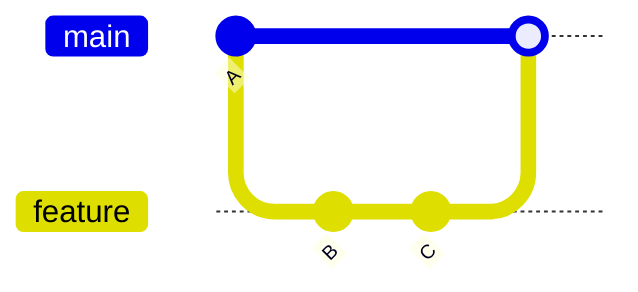
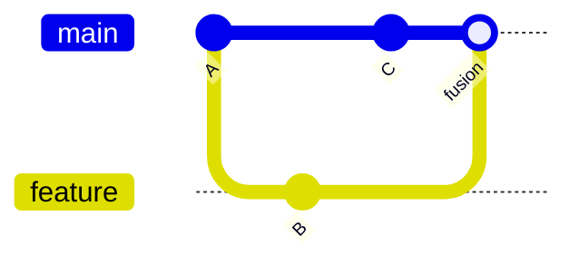
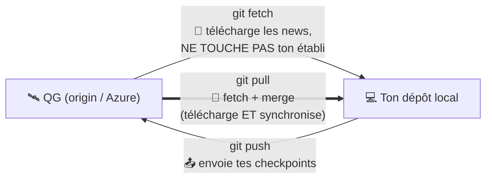

# 🕹️ Git pour Actuaires — La Machine à Voyager dans le Temps de ton Code

> **Formation Git — 2 heures, en démo live.**
> Tu n'as jamais programmé ? Parfait. Aucune ligne de code Python ici. Juste toi, tes fichiers, et un super-pouvoir : **revenir en arrière dans le temps sans jamais rien perdre.**

---

## 🎯 Objectifs pédagogiques

À la fin de ces 2 heures, tu sauras :

- Comprendre **le modèle mental** de Git (les 3 zones) — le truc que 90 % des gens ratent.
- Faire des **checkpoints** propres de ton travail (`add`, `commit`).
- **Voyager dans le temps** : revenir à une version précédente, annuler une bêtise.
- Créer des **univers parallèles** (branches) et les **fusionner**.
- Travailler **à plusieurs** via un QG distant (Azure) : `clone`, `fetch`, `pull`, `push`.
- Te **sortir de toutes les galères** : conflits, fichier perdu, mauvaise branche… avec le sourire.

---

## 🎲 Les 3 règles du jeu

1. **🛟 Règle d'OR (la plus importante) :** *« N'aie pas peur de casser quelque chose : avec Git, presque tout se récupère. »* Git oublie **très** rarement. On a un bouton panique (`git reflog`) pour ressusciter ce qu'on croyait perdu.
2. **🧭 `git status` est ta boussole.** On le lit **AVANT** et **APRÈS** chaque commande. Toujours. C'est gratuit, c'est rassurant, ça évite 95 % des erreurs.
3. **💾 Un checkpoint, c'est sacré.** Un `commit` est figé, daté et **signé à ton nom**. C'est ta sauvegarde de partie. On en fait souvent, petits et thématiques.

---

## 📚 Table des matières

0. [Page de garde & règles du jeu](#-git-pour-actuaires--la-machine-à-voyager-dans-le-temps-de-ton-code) *(tu y es)*
1. [Pourquoi Git ?](#1--pourquoi-git-)
2. [La Pierre de Rosette (le vocabulaire)](#2--la-pierre-de-rosette--le-dictionnaire-parallèle)
3. [Le modèle mental central : les 3 zones](#3--le-modèle-mental-central--les-3-zones)
4. [Mise en place & identité](#4--mise-en-place--identité)
5. [Le cycle de base — `git status` est le héros](#5--le-cycle-de-base--git-status-est-le-héros)
6. [Voyager dans le temps SANS PEUR](#6--voyager-dans-le-temps-sans-peur)
7. [Les univers parallèles (branches & merge)](#7--les-univers-parallèles--branches--merge)
8. [Rebase : réécrire l'histoire (`rebase -i`)](#8--rebase--réécrire-lhistoire-proprement)
9. [Le QG distant (Azure) : fetch / pull / push](#9--le-qg-distant-azure--fetch--pull--push)
10. [Voir les différences (diffs)](#10--voir-les-différences--les-diffs)
11. [Ranger temporairement : le stash](#11--ranger-temporairement--le-stash)
12. [`.gitignore` : la liste rouge](#12--gitignore--la-liste-rouge)
13. [Les alias : gagner du temps](#13--les-alias--gagner-du-temps)
14. [GitLens : rendre l'invisible visible](#14--gitlens--rendre-linvisible-visible)
15. [Lire le tableau de bord (le watcher)](#15--lire-le-tableau-de-bord-le-watcher)
16. [Conclusion & et après ?](#16--conclusion--et-après-)
17. [Annexe — Scénarios de démo pas-à-pas](#17--annexe--scénarios-de-démo-pas-à-pas)

---

## 1. 🤔 Pourquoi Git ?

### Le drame de `rapport_final`

Tu connais forcément ce dossier d'horreur :

```
rapport_final.xlsx
rapport_final_v2.xlsx
rapport_final_v2_corrigé.xlsx
rapport_final_v2_VRAIMENT_final.xlsx
rapport_final_v2_VRAIMENT_final_v3_OK_signé.xlsx
rapport_final_NE_PAS_UTILISER.xlsx
```

Questions existentielles : *Lequel est le bon ? Qui a modifié quoi ? Comment revenir à la version d'avant-hier matin, celle qui marchait ?* 😱

**Git, c'est la fin de ce cauchemar.** Un seul fichier, `rapport_final.xlsx`, et **tout l'historique** rangé proprement à côté, invisible mais accessible : chaque version, qui l'a faite, quand, et pourquoi.

### Git = une machine à voyager dans le temps 🕰️

Imagine un jeu vidéo où :

- Tu peux faire un **checkpoint** (point de sauvegarde) à tout moment.
- Tu peux **recharger n'importe quelle sauvegarde** ultérieurement.
- Tu peux créer des **timelines parallèles** pour tester un truc risqué, et si ça foire, tu reviens dans la timeline principale comme si de rien n'était.
- Et tu joues **en coopération** avec 6 collègues, chacun sur sa machine, en se synchronisant via un **QG commun**.

C'est exactement ça, Git. Tu n'écris pas du code « pour Git » : Git **emballe ton travail** (tes fichiers Excel, Python, Word, peu importe) et lui donne des super-pouvoirs temporels.

### Collaboration sans s'écraser

À 7 personnes sur les mêmes fichiers, Git permet à chacun de travailler **en parallèle** puis de **fusionner** intelligemment. Et quand deux personnes touchent exactement la même ligne ? Git lève la main poliment : *« Hé, paradoxe temporel, choisis. »* (On verra que c'est beaucoup moins effrayant que ça en a l'air.)

---

## 2. 🪨 La Pierre de Rosette — le dictionnaire parallèle

Git parle un jargon bizarre. Voici **la table de traduction** qu'on va utiliser **partout** dans cette formation. Garde-la sous le coude.

| Terme Git | En français simple | La métaphore (⏳ temps + 🎮 jeu) |
|---|---|---|
| **repository** (dépôt) | la base de toutes tes sauvegardes | 🚀 ton **vaisseau temporel** (toutes tes parties dedans) |
| **working directory** | là où tu modifies les fichiers | 🛠️ ton **établi** / ta table de bricolage (le présent, le brouillon) |
| **staging area** (index) | ce que tu as choisi de figer | 🧺 le **panier de courses** avant la caisse / le **SAS** d'embarquement |
| **commit** | une sauvegarde figée et signée | 💾 un **checkpoint** (save game), daté et signé |
| **HEAD** | ta position actuelle | 📍 le panneau **« TU ES ICI »** dans le temps |
| **branch** (branche) | une ligne de travail séparée | 🌌 une **timeline** / un univers parallèle / un « run » alternatif |
| **checkout / switch** | changer de version / de branche | 🌀 **voyager** dans le temps / changer d'univers |
| **merge** | combiner deux branches | 🔗 **fusion** de deux timelines |
| **conflict** | deux modifs incompatibles | ⚡ un **paradoxe temporel** (à dédramatiser !) |
| **clone** | copier tout depuis le QG | 📥 copier **tout l'univers** depuis le QG |
| **remote / origin** | le serveur central (Azure) | 🛰️ le **QG** / le serveur partagé |
| **fetch** | récupérer les nouvelles, sans rien changer | 🔭 **télécharger** en reconnaissance (download espion) |
| **pull** | fetch + merge | 🔄 **télécharger + synchroniser** |
| **push** | envoyer tes checkpoints au QG | 📤 **envoyer** (upload) au QG |
| **reset** | remonter le temps (réécrit l'histoire) | ⏪ **rembobiner** (soft / mixed / hard) |
| **revert** | annuler en créant un anti-commit | ↩️ un **anti-checkpoint** (sûr, ne réécrit rien) |
| **restore** | restaurer un fichier | 🩹 revenir à la **dernière sauvegarde** d'un fichier |
| **stash** | mettre de côté sans commit | 🎒 la **poche dimensionnelle** / coffre temporaire |
| **tag** | marquer une version officielle | 🏷️ une **borne** / marque-page (v1.0) |
| **diff** | comparer deux instants | 🔍 le **détecteur** de changements |
| **log** | l'historique | 📜 la **chronologie** / journal de bord |
| **.gitignore** | ce qu'on ne sauvegarde jamais | 🚫 la **liste rouge** |

### 🇬🇧↔🇫🇷 Les verbes clés (à mémoriser)

| Anglais | Français |
|---|---|
| **fetch** | télécharger (en reconnaissance) |
| **pull** | télécharger **+ synchroniser** |
| **push** | envoyer / téléverser |
| **commit** | sauvegarder (checkpoint) |
| **stage / add** | préparer (mettre au panier) |
| **merge** | fusionner |

> 💡 **Astuce :** quand une commande t'angoisse, traduis-la avec ce tableau. « `git push` » devient « j'envoie mes checkpoints au QG ». Tout de suite moins effrayant.

---

## 3. 🧠 Le modèle mental central : les 3 zones

**C'est LA section. Si tu ne retiens qu'une chose aujourd'hui, c'est celle-ci.**

Git range ton travail dans **3 zones**, plus le QG distant. Un fichier voyage de zone en zone :



### Zone 1 — 🛠️ Le Working Directory (l'établi)

C'est ton dossier de travail **tel que tu le vois** dans l'explorateur de fichiers. Quand tu ouvres ton `.xlsx` et que tu tapes dedans, tu bricoles **sur l'établi**. C'est le **présent**, le brouillon. Rien n'est encore sauvegardé pour l'éternité.

### Zone 2 — 🧺 La Staging Area (le panier / le SAS)

**C'est le concept que tout le monde rate.** Avant de faire un checkpoint, tu **choisis** ce qui va dedans. Tu fais tes courses : tu mets dans le **panier** uniquement les modifications que tu veux figer maintenant.

> ❓ **Pourquoi cette zone existe ?**
> Parce que tu ne veux pas toujours tout sauvegarder d'un coup. Imagine que tu as modifié **3 fichiers** pour 2 raisons différentes (corriger un calcul de prime **et** changer une couleur de graphique). Tu peux faire **deux checkpoints propres et thématiques** :
> - Checkpoint 1 : « Correction du calcul » (tu mets au panier seulement les fichiers concernés).
> - Checkpoint 2 : « Mise à jour du graphique ».
>
> Résultat : un historique **lisible**, où chaque checkpoint raconte **une seule histoire**. C'est précieux quand, dans 3 mois, tu cherches *quand* et *pourquoi* un calcul a changé.

C'est le **SAS d'embarquement** : tout ce qui est dans le SAS embarquera dans le prochain checkpoint. Ce qui reste sur l'établi attendra le prochain voyage.

### Zone 3 — 💾 Le Repository (le vaisseau temporel)

Quand tu fais `git commit`, le contenu du panier devient un **checkpoint figé** : daté, signé à ton nom, avec un message. Il rejoint l'historique permanent de ton vaisseau. **À partir de là, il est en sécurité** : tu pourras toujours y revenir.

### Zone 4 — 🛰️ Le QG distant (origin / Azure)

Ton vaisseau est sur **ta** machine. Pour partager avec l'équipe, tu **envoies** (`push`) tes checkpoints au QG, et tu **récupères** (`pull`) ceux des autres.

> 🧪 **À tester dans le watcher :** ouvre http://localhost:4242 pendant la démo. Tu verras **physiquement** un fichier passer du Working Directory à la Staging Area quand le formateur tape `git add`, puis disparaître des deux pour rejoindre le graphe de commits au `git commit`. Le déclic visuel est garanti.

---

## 4. ⚙️ Mise en place & identité

### Te présenter à Git (ta signature)

Chaque checkpoint est **signé**. Git doit savoir qui tu es :

```bash
git config --global user.name "Oussama"
git config --global user.email "oussama@formation.git"
```

> 💡 **Astuce :** `--global` = pour tous tes projets sur cette machine. Sans `--global`, c'est juste pour le projet courant. Dans notre terrain de jeu, chaque dépôt local (Oussama, Jorge, Anya, Elsa, Zaka, Thomas, Othmane) a **sa propre identité** — c'est pour ça que dans le graphe on verra qui a fait quoi.

Pour vérifier :

```bash
git config user.name        # Oussama
git config user.email       # oussama@formation.git
git config --list           # tout voir
```

> ❓ **Pourquoi signer ?** Parce que dans 6 mois, quand on regardera la chronologie à 7, on saura que c'est **Anya** qui a touché tel calcul tel jour. La signature, c'est la traçabilité. C'est l'or de l'actuaire.

### ⚙️ Régler l'éditeur — et survivre au piège de Vim

> ⚠️ **Le piège n°1 du débutant :** si tu tapes `git commit` **sans** `-m "..."` (ou pendant un
> merge), Git ouvre un **éditeur de texte** pour que tu rédiges le message. Par défaut, c'est
> souvent **Vim** — un éditeur austère où le clavier ne réagit pas comme tu l'imagines. Énormément
> de débutants se retrouvent **bloqués** là-dedans, à taper frénétiquement sans pouvoir sortir. 😱
>
> **🆘 Sortir de Vim en urgence :** appuie sur `Échap`, puis tape l'une de ces deux formules suivie de `Entrée` :
> - `:wq` → **sauver** le message et quitter
> - `:q!` → **annuler** et quitter sans sauver
>
> **La vraie solution (une fois pour toutes) :** dis à Git d'utiliser **VS Code** comme éditeur.
> Tes messages s'écriront dans un onglet VS Code confortable :
> ```bash
> git config --global core.editor "code --wait"
> ```
> Le `--wait` est **essentiel** : il dit à Git d'**attendre** que tu fermes l'onglet avant de reprendre la main.

### 🧰 La config utile (à régler une fois pour toutes)

Quelques réglages `--global` qui te simplifient la vie pour toujours :

```bash
git config --global core.editor "code --wait"   # éditeur = VS Code (anti-Vim)
git config --global init.defaultBranch main      # nouvelles repos → branche "main" (pas "master")
git config --global pull.rebase false            # 'git pull' = fusionne (le plus simple pour débuter)
git config --global core.autocrlf true           # Windows : gère les fins de ligne proprement (réglage standard)
git config --global color.ui auto                # de la couleur dans le terminal
git config --global credential.helper manager    # Windows : mémorise tes accès au QG distant (Azure)
```

**Voir et éditer ta config :**

```bash
git config --list --show-origin     # TOUT voir, avec le fichier d'où vient chaque réglage
git config --global --edit          # ouvrir le fichier de config global dans l'éditeur
git config user.name                # lire UNE valeur précise
```

> 💡 **Astuce — la config en cascade :** Git lit les réglages dans l'ordre **système → global (ton
> utilisateur) → local (le projet courant)**. Le plus **précis gagne**. C'est exactement pour ça
> que chaque dépôt du terrain de jeu (Oussama, Jorge, …) peut avoir **sa propre identité** (config
> *locale*) tout en héritant de tes réglages *globaux*.

> 📌 Il existe une autre famille de config qui fait gagner un temps fou : les **alias**. On les voit en [section 13](#13--les-alias--gagner-du-temps).

### Créer un dépôt : `git init`

Dans n'importe quel dossier :

```bash
git init
```

Ça crée un sous-dossier caché `.git/` : **c'est le vaisseau temporel**. Tout l'historique vivra là-dedans. Ton dossier devient un dépôt Git. (On ne touche jamais à l'intérieur de `.git/` à la main — c'est la salle des machines.)

### C'est quoi un dépôt **bare** ? (et pourquoi le QG en est un)

Dans notre terrain de jeu, le dossier `playground/AZURE_REPO/` est un dépôt **bare**. Différence capitale :

| | Dépôt **normal** (ta machine) | Dépôt **bare** (le QG / Azure) |
|---|---|---|
| Working directory (établi) | ✅ oui, tu vois les fichiers | ❌ **non**, pas d'établi |
| Historique des commits | ✅ oui | ✅ oui |
| Sert à… | **travailler** | **échanger** (point de rendez-vous) |

> ❓ **Pourquoi le QG est bare ?**
> Le QG n'est **pas** un endroit où on bricole. C'est une **boîte aux lettres centrale** : tout le monde y dépose (`push`) et y récupère (`pull`) des checkpoints. S'il avait un établi, deux personnes pourraient écraser le brouillon l'une de l'autre — le chaos. En étant **bare** (juste l'historique, pas de fichiers de travail), il reste un point d'échange neutre et propre. Sur Azure DevOps / GitHub, **tous** les remotes sont bare.

> 🧪 **À tester dans le watcher :** le watcher affiche un **badge** différent pour les dépôts `bare` et `normal`. `AZURE_REPO` apparaîtra marqué **bare** (sans établi visible), les 7 autres en **normal**.

---

## 5. 🦸 Le cycle de base — `git status` est le héros

Le cœur du quotidien tient en 3 mots : **status → add → commit**. Et entre chaque, on relit **status**.



### `git status` — ta boussole (lis-le tout le temps)

```bash
git status
```

Il te dit **où en est chaque fichier**. Apprends à lire ses 3 grandes catégories :

- **Untracked files** (« fichiers non suivis ») 🆕 : Git voit ce fichier mais ne le surveille pas encore. Il est nouveau sur l'établi, jamais mis au panier.
- **Changes not staged for commit** (« modifié, pas préparé ») ✏️ : un fichier déjà suivi que tu as modifié sur l'établi, mais qui n'est **pas** encore dans le panier.
- **Changes to be committed** (« préparé, prêt à figer ») 🧺 : c'est dans le panier (staging), ça partira au prochain `commit`.

> 🧭 **Règle d'or :** `git status` **avant** une commande (pour savoir d'où tu pars) et **après** (pour vérifier l'effet). C'est gratuit et ça t'évitera 95 % des paniques.

### `git add` — préparer (mettre au panier)

```bash
git add rapport.xlsx        # un fichier précis
git add dossier/            # tout un dossier
git add .                   # TOUT ce qui a changé dans le dossier courant
git add -p                  # mode interactif : choisir morceau par morceau
```

> 💡 **Astuce — `git add -p` (le mode chirurgien) :** il te montre chaque bout de modification (« hunk ») et te demande `Stage this hunk? [y,n,...]`. Idéal pour mettre au panier **une partie** d'un fichier et laisser le reste. C'est la staging area poussée à son maximum.

> ⚠️ **Piège — `git add .` :** pratique, mais il embarque **tout**, y compris des fichiers que tu ne veux pas (gros `.xlsx`, données sensibles). D'où l'intérêt du `.gitignore` (section 12). Lis toujours `git status` après un `git add .`.

### `git commit` — sauvegarder (faire le checkpoint)

```bash
git commit -m "Ajout du calcul de la prime pure"
```

Le `-m` donne le **message** du checkpoint. Un bon message décrit **ce que** ce checkpoint accomplit, à l'impératif présent :

- ✅ `"Corrige l'arrondi sur le taux de chargement"`
- ❌ `"trucs"`, `"maj"`, `"asdf"` (ton toi-du-futur te détestera)

### `git commit --amend` — corriger le DERNIER checkpoint

Tu as oublié un fichier, ou fait une faute dans le message ? Tant que tu n'as **pas** encore `push`, tu peux rattraper le **dernier** commit :

```bash
git add fichier_oublié.xlsx
git commit --amend -m "Message corrigé"
```

> ⚠️ **Piège :** `--amend` **réécrit** le dernier checkpoint (il change son identité). À éviter sur un commit déjà envoyé au QG et récupéré par d'autres (ça crée des paradoxes pour eux). Règle simple : **amend seulement ce que tu n'as pas encore push.**

### `git log` — la chronologie (le journal de bord)

```bash
git log                              # historique complet, détaillé
git log --oneline                    # une ligne par checkpoint (compact)
git log --oneline --graph --all      # ✨ le plus beau : graphe ASCII de TOUTES les branches
```

> 💡 **Astuce :** `git log --oneline --graph --all` est tellement utile qu'on en fera un **alias** (`git lg`, section 13). Tu verras les timelines se dessiner sous tes yeux.

> 🧪 **À tester dans le watcher :** fais un `git add` puis un `git commit` et regarde l'écran : le fichier glisse Working → Staging → puis un nouveau **nœud** apparaît dans le graphe de commits, signé à ton nom. C'est la boucle complète, en direct.

---

## 6. 🕰️ Voyager dans le temps SANS PEUR

> 🛟 **Rappel de la règle d'or :** *« N'aie pas peur de casser quelque chose : avec Git, presque tout se récupère. »* Cette section est ta machine à voyager. On garde le sourire.

### HEAD — « TU ES ICI » 📍

`HEAD` est le panneau **« TU ES ICI »**. Il pointe sur le checkpoint où tu te trouves actuellement (le bout de ta branche en général). Quand tu voyages, c'est `HEAD` qui se déplace.

### Retrouver un checkpoint passé

```bash
git log --oneline       # repère le code (SHA) du checkpoint, ex: a1b2c3d
```

Chaque checkpoint a un **identifiant** unique (un SHA, genre `a1b2c3d`). C'est sa coordonnée temporelle.

### Aller visiter un commit : `git switch` / `git checkout`

```bash
git switch --detach a1b2c3d   # voyager VOIR un ancien checkpoint
# (ancienne syntaxe équivalente)
git checkout a1b2c3d
```

Tu te retrouves en **« detached HEAD »**. Pas de panique, c'est juste :

> 🧘 **Le detached HEAD, calmement :** ça veut dire *« TU ES ICI, mais pas au bout d'une branche — tu visites un point figé du passé. »* Tu peux regarder, lancer des trucs, comparer. Si tu veux **revenir au présent** :
> ```bash
> git switch -        # retour à la branche d'où tu venais
> ```
> Tu n'as **rien cassé**. Tu as juste fait du tourisme temporel.

### `git restore` — restaurer un fichier (revenir à la dernière sauvegarde)

Tu as massacré un fichier sur l'établi et tu veux la version du dernier checkpoint ?

```bash
git restore rapport.xlsx          # jette tes modifs NON commitées sur ce fichier
git restore .                     # idem pour tous les fichiers
```

Pour **retirer un fichier du panier** (le sortir du staging, sans perdre tes modifs) :

```bash
git restore --staged rapport.xlsx   # le fichier quitte le panier, mais tes modifs restent sur l'établi
```

> ⚠️ **Piège :** `git restore rapport.xlsx` (sans `--staged`) **jette** définitivement tes modifications **non commitées** de ce fichier. Ça, ça ne se récupère pas (ce n'était jamais un checkpoint). Tout ce qui est commité, en revanche, se récupère toujours.

### `git reset` — rembobiner (soft / mixed / hard)

`reset` **déplace HEAD** vers un checkpoint antérieur. Selon le mode, il touche plus ou moins les zones. **Le tableau à retenir** :

| Commande | 💾 Historique (HEAD) | 🧺 Staging (panier) | 🛠️ Working dir (établi) | En clair |
|---|---|---|---|---|
| `git reset --soft <sha>` | ⏪ recule | **gardé** | **gardé** | « Annule le commit, mais garde tout prêt à recommiter » |
| `git reset --mixed <sha>` *(défaut)* | ⏪ recule | **vidé** | **gardé** | « Annule le commit et vide le panier ; tes modifs restent sur l'établi » |
| `git reset --hard <sha>` | ⏪ recule | **vidé** | ⚠️ **écrasé** | « Rembobine TOUT, y compris l'établi » |

```bash
git reset --soft HEAD~1     # défait le dernier commit, garde tout au panier
git reset --mixed HEAD~1    # défait le dernier commit, vide le panier (modifs sur l'établi)
git reset --hard HEAD~1     # ⚠️ rembobine tout, perd les modifs non commitées
```

> 💡 `HEAD~1` = « un cran avant HEAD », `HEAD~2` = « deux crans avant ». Pratique pour ne pas copier des SHA.

> ⚠️ **Piège — `--hard` :** c'est le seul qui peut **détruire** du travail non commité (l'établi est écrasé). Mais même là, les **commits** restent récupérables via `reflog` (voir le bouton panique). Le travail jamais commité, lui, est le seul vraiment vulnérable. **Morale : commite souvent.**

### `git revert` — l'anti-checkpoint (sûr, ne réécrit pas l'histoire) ↩️

Tu as commité (et peut-être push) une bêtise, et tu veux l'annuler **proprement, sans réécrire l'histoire** ? `revert` crée un **nouveau** checkpoint qui **inverse** un checkpoint précédent :

```bash
git revert a1b2c3d        # crée un commit qui annule a1b2c3d
```

> 💡 **`reset` vs `revert` — la distinction qui sauve :**
> - `reset` = **rembobiner** la cassette (réécrit l'histoire) → bien **en local, avant de push**.
> - `revert` = **anti-checkpoint** (ajoute une nouvelle page qui dit « on annule ») → **sûr même après push**, car l'historique des autres n'est pas perturbé.
> Sur un dépôt **partagé** (le QG), on préfère **`revert`**.

### 🆘 Le bouton panique : `git reflog`

> *« J'ai fait un `reset --hard` et j'ai perdu mon commit ! »* — Respire. **Git oublie rarement.**

`git reflog` est le **journal secret de tous tes déplacements de HEAD**, même ceux que `git log` ne montre plus :

```bash
git reflog                    # liste TOUT, y compris les commits "perdus"
# tu repères le SHA du commit perdu, ex: a1b2c3d, puis :
git reset --hard a1b2c3d      # tu ressuscites ton commit
```

> 🛟 **C'est LE message de cette formation :** tant que tu avais fait un **commit**, ton travail vit encore quelque part dans `.git/`, et `reflog` te donne la carte au trésor. Garde-le précieusement.

> 🧪 **À tester dans le watcher :** lors du scénario « j'ai tout cassé » (annexe f), regarde le graphe : après le `reset --hard <sha>` de récupération, le commit « perdu » **réapparaît** dans le graphe. Effet magique garanti.

---

## 7. 🌌 Les univers parallèles — branches & merge

### À quoi sert une branche ?

Une **branche** est une **timeline parallèle**. Tu veux tester une idée risquée (un nouveau modèle de tarification, une refonte) sans casser la version stable ? Tu crées une branche, tu bricoles dedans, et :

- Si ça marche → tu **fusionnes** (merge) dans la timeline principale.
- Si ça foire → tu **abandonnes** la branche, la timeline principale n'a jamais été touchée. Zéro dégât.

La branche principale s'appelle traditionnellement `main` (anciennement `master`).

```bash
git branch                       # lister les branches (★ = la courante)
git branch experimentation       # créer une branche (sans y aller)
git switch -c experimentation    # créer ET y voyager (le plus courant)
git switch main                  # revenir sur main
```

### Visualisons une branche



Ici, `experimentation` part de `main` et vit sa vie pendant que `main` continue de son côté. Deux univers, en parallèle.

### `git merge` — la fusion 🔗

Tu es content de ton expérimentation et tu veux la ramener dans `main` :

```bash
git switch main                  # on se met SUR la branche qui va RECEVOIR
git merge experimentation        # on fusionne experimentation DANS main
```

#### Deux cas de fusion

**1. Fast-forward (avance rapide) ⏩** — si `main` n'a pas bougé depuis que la branche est partie, Git « glisse » simplement le pointeur `main` vers l'avant. Pas de nouveau commit, c'est tout propre.



**2. Merge commit (vraie fusion) 🔀** — si les **deux** branches ont avancé chacune de leur côté, Git crée un **commit de fusion** spécial qui réunit les deux timelines.



### ⚡ Le paradoxe temporel : le conflit (à dédramatiser)

Un **conflit** arrive quand **deux timelines ont modifié la MÊME ligne du MÊME fichier**. Git ne peut pas deviner laquelle garder, alors il te passe la main poliment. **Ce n'est pas une erreur, c'est une question.**

Quand tu fais un `merge` conflictuel, Git **marque** la zone litigieuse dans le fichier comme ceci :

```text
<<<<<<< HEAD
taux_chargement = 0.15        ← ta version (la branche courante)
=======
taux_chargement = 0.18        ← la version d'en face (la branche fusionnée)
>>>>>>> experimentation
```

#### Résoudre un conflit, étape par étape 🧩

1. `git status` te liste les fichiers « both modified » (en conflit). **Lis-le.**
2. **Ouvre** chaque fichier marqué. Tu vois les balises `<<<<<<<`, `=======`, `>>>>>>>`.
3. **Décide** : tu gardes ta version, celle d'en face, ou un mélange des deux. **Supprime** les 3 balises et laisse le résultat final propre :
   ```text
   taux_chargement = 0.18
   ```
4. `git add fichier_resolu.xlsx` → tu dis à Git « c'est réglé, je l'ai au panier ».
5. `git commit` → tu valides la fusion. (Git propose déjà un message de merge, tu peux le garder.)

> 🆘 **Le bouton « annuler la fusion » :** tu paniques au milieu d'un merge ? Tu veux tout remettre comme avant le `merge` ?
> ```bash
> git merge --abort
> ```
> Et hop, retour à l'état d'avant, comme si tu n'avais jamais lancé la fusion. **Rien de cassé.**

> 🖱️ **Le confort VS Code — l'éditeur de fusion à 3 volets :** plutôt que de supprimer les balises
> `<<<<<<<` / `=======` / `>>>>>>>` à la main, ouvre le fichier en conflit dans **VS Code** et clique
> sur **« Resolve in Merge Editor »**. Tu obtiens une vue à **3 volets** : **Current** (ta version) à
> gauche, **Incoming** (la version d'en face) à droite, et le **Résultat** en bas. Tu cliques
> *Accept Current* / *Accept Incoming* / *Accept Both* ligne par ligne, et le résultat se construit
> tout seul, sans jamais toucher aux chevrons. Beaucoup moins intimidant. *(GitLens — section 14 —
> enrichit encore cette vue en montrant qui a écrit quoi.)*

> 🧘 **Dédramatisation :** un conflit, ce n'est pas Git qui t'engueule. C'est Git qui dit *« il y a deux vérités possibles ici, toi seul peux trancher »*. C'est même un signe de **bonne collaboration** : deux personnes ont travaillé au même endroit, on harmonise.

> 🧪 **À tester dans le watcher :** pendant un conflit, le watcher montre les deux branches qui pointent vers des commits différents. Après résolution + commit, un **nœud de fusion** relie les deux timelines dans le graphe.

---

## 8. 🔀 Rebase — réécrire l'histoire proprement

> 🛟 **Rappel de la règle d'or :** *« presque tout se récupère »* vaut **aussi** pour le rebase
> (via `reflog`). Mais le rebase a **sa propre** règle d'or — on y vient. C'est un outil
> **puissant** : on l'apprend pour **ranger** son travail, pas pour s'angoisser.

Le `merge` (section 7) **réunit** deux timelines en gardant leur histoire telle qu'elle s'est
passée. Le **rebase**, lui, **rejoue** tes checkpoints **comme si** tu étais parti d'un point plus
récent. C'est à la fois une autre façon d'**intégrer** une branche, et — surtout — un **atelier de
montage** pour rendre ton historique **propre** avant de le partager.

### L'idée : déplacer le point de départ de ta branche

Ta branche `feature` est partie de `main` il y a longtemps, et depuis `main` a avancé.
`git rebase main` **soulève** tous tes commits de `feature` et les **repose** au-dessus du `main`
actuel — comme si tu venais tout juste de créer ta branche.

```bash
git switch feature
git rebase main        # rejoue les commits de feature PAR-DESSUS le main à jour
```

```text
AVANT                                  APRÈS  (git rebase main)

      A---B---C  feature                            A'--B'--C'  feature
     /                                             /
D---E---F---G  main                    D---E---F---G  main
```

> A, B, C sont **rejoués** en A', B', C' : de **nouveaux** checkpoints (nouveaux identifiants).
> L'historique devient **linéaire**, comme une seule ligne de temps bien rangée.

### Rebase vs Merge — deux philosophies

```text
MERGE  (git switch main ; git merge feature)     REBASE  (puis main avance en ligne droite)

      A---B---C                                   D---E---F---G---A'--B'--C'   main
     /         \                                  (une seule ligne, toute droite)
D---E---F---G---M   main  (M = commit de fusion)
```

| | **Merge** 🔗 | **Rebase** 🔀 |
|---|---|---|
| Historique | **fidèle** (montre la vraie divergence) | **linéaire** (réécrit, comme si tout était en séquence) |
| Commit de fusion | oui (un nœud `M`) | non |
| Identifiants (SHA) | inchangés | **changés** (commits rejoués = nouveaux SHA) |
| Graphe | peut devenir touffu (« spaghetti ») | tout droit, facile à lire |
| Idéal pour | intégrer une branche **partagée**, garder la trace | **ranger TON travail local** avant de le pousser |

> 💡 **En une phrase :** *merge = « on raconte l'histoire telle qu'elle s'est passée » ;
> rebase = « on remonte le film proprement avant la projection ».*

### ⚠️ LA règle d'or du rebase

> ⚠️ **Ne rebase JAMAIS des commits déjà partagés** (déjà poussés au QG et récupérés par d'autres).
> Rebaser, c'est **réécrire l'histoire** : les commits changent d'identifiant. Si quelqu'un avait
> déjà ces commits, tu crées des **paradoxes** pour toute l'équipe.
>
> ✅ **Règle simple :** *rebase uniquement ce qui est encore **chez toi**, pas encore poussé.*
> Une fois publié, on préfère **`merge`** ou **`revert`**.

### 🎬 Le rebase interactif (`rebase -i`) — la table de montage

**C'est le super-pouvoir.** Avant de publier, tu peux **ré-éditer ta propre timeline** : fusionner
des checkpoints brouillons, les réordonner, renommer leurs messages, en supprimer. On ouvre la
**table de montage** sur les N derniers commits :

```bash
git rebase -i HEAD~4      # ré-éditer les 4 derniers checkpoints
```

Git ouvre ton éditeur (VS Code si tu l'as réglé en [section 4](#4--mise-en-place--identité) ✅) avec
la liste, **du plus ancien au plus récent**, un **verbe** devant chaque commit :

```text
pick   a1b2c3d  Ajoute le calcul de prime pure
squash e4f5g6h  wip
fixup  i7j8k9l  oops, corrige un typo
reword m0n1o2p  taux

# Verbes possibles :
#   pick   = garder tel quel
#   reword = garder, mais RENOMMER le message
#   squash = FUSIONNER avec la ligne du dessus (garde les deux messages)
#   fixup  = fusionner avec la ligne du dessus (JETTE le message) -> parfait pour un "oops"
#   edit   = s'ARRÊTER sur ce commit pour le modifier
#   drop   = SUPPRIMER ce commit
# Réordonner les lignes = réordonner les commits.
```

Tu modifies les verbes (et l'ordre des lignes), tu **sauves et fermes** l'onglet, et Git **rejoue**
la séquence selon tes instructions. Exemple ci-dessus : 4 commits brouillons → **1 checkpoint
propre** + **1** au message corrigé.

> 💡 **Les 3 usages qui changent la vie :**
> - **`squash` / `fixup`** : transformer une pluie de « wip », « wip2 », « fix » en **un seul**
>   checkpoint qui raconte une histoire claire.
> - **`reword`** : corriger un message de commit honteux (sans toucher au code).
> - **réordonner / `drop`** : remettre les checkpoints dans l'ordre logique, ou en jeter un.

> 🔗 **Tu connais déjà un mini-rebase :** `git commit --amend` (section 5), c'est exactement
> « rebase interactif, mais sur le **dernier** commit seulement ».

#### Si un conflit surgit pendant le rejeu

Comme pour un merge, rejouer des commits peut créer un **paradoxe temporel** (conflit). Pas de panique :

```bash
# 1. Git s'arrête sur le commit en conflit -> on lit  git status
# 2. On résout (à la main, ou dans l'éditeur de fusion VS Code), puis :
git add <fichier_resolu>
git rebase --continue        # on reprend le rejeu
# ... ou, pour TOUT annuler et revenir à l'état d'avant :
git rebase --abort           # 🆘 retour avant le rebase, rien de cassé
```

### 🥇 En pratique, au quotidien

```bash
# Nettoyer 5 commits brouillons en 1-2 commits propres AVANT de pousser :
git rebase -i HEAD~5

# Récupérer le travail du QG en gardant une histoire LINÉAIRE (au lieu d'un commit de fusion) :
git pull --rebase            # = fetch + rebase (rejoue TES commits par-dessus ceux du QG)
```

> 🧪 **À tester dans le watcher :** prends une branche bien divergente, lance un `rebase`, et
> regarde le graphe **se redresser** : la timeline en zigzag devient une ligne droite. Très satisfaisant.

> 🛟 **Filet de sécurité :** même après un rebase « raté », `git reflog` retrouve tes commits
> d'avant-rebase (puis `git reset --hard <sha>` pour y revenir). **Git oublie rarement.**

---

## 9. 🛰️ Le QG distant (Azure) — fetch / pull / push

Jusqu'ici, tout vivait sur **ta** machine. Pour collaborer à 7, on passe par le **QG** (`origin`), hébergé sur Azure. Dans notre terrain de jeu, c'est `playground/AZURE_REPO/` (le dépôt **bare**).

### `git clone` — copier tout l'univers depuis le QG 📥

```bash
git clone <url-azure> mon-dossier
```

Ça télécharge **tout** : tous les fichiers, **tout** l'historique, **toutes** les branches. Et ça configure automatiquement le QG sous le nom `origin`. C'est comme ça que chacun des 7 (Oussama, Jorge, Anya, Elsa, Zaka, Thomas, Othmane) a obtenu sa copie locale.

### `git remote -v` — voir les QG connectés

```bash
git remote -v
# origin  <url-azure> (fetch)
# origin  <url-azure> (push)
```

`origin` est juste un **surnom** pour l'URL du QG. (On pourrait en avoir plusieurs, mais un seul suffit largement ici.)

### La distinction CAPITALE : fetch vs pull vs push



| Commande | Ce que ça fait | Métaphore |
|---|---|---|
| **`git fetch`** | Récupère les nouveautés du QG dans un coin, **sans rien changer** à ton travail | 🔭 reconnaissance : « je regarde ce qui est arrivé, sans toucher à rien » |
| **`git pull`** | `fetch` **+** `merge` : récupère **et** intègre dans ta branche | 🔄 « je télécharge ET je synchronise » |
| **`git push`** | Envoie **tes** checkpoints locaux vers le QG | 📤 « j'upload mes sauvegardes » |

> 💡 **Pourquoi `fetch` est rassurant :** il est **100 % sans danger**. Il ne modifie jamais ton établi ni tes branches. Tu peux ensuite regarder ce qui est arrivé (`git log origin/main`) **avant** de décider de fusionner. `pull`, lui, fusionne directement — pratique mais moins prudent.

### Ahead / behind — où tu en es par rapport au QG

`git status` te dit ta position relative :

- **« ahead by 2 »** = tu as 2 checkpoints **en avance** (pas encore envoyés) → il faut **push**.
- **« behind by 3 »** = le QG a 3 checkpoints que tu n'as **pas** → il faut **pull**.

```bash
git status
# Your branch is ahead of 'origin/main' by 2 commits.   → git push
# Your branch is behind 'origin/main' by 3 commits.      → git pull
```

### Envoyer pour la première fois : `git push -u`

```bash
git push -u origin main      # la 1re fois : -u "lie" ta branche locale à celle du QG
git push                     # ensuite, un simple "git push" suffit
```

Le `-u` (pour `--set-upstream`) crée le lien une bonne fois pour toutes. Après ça, Git sait tout seul où envoyer.

### Le workflow en or : « pull avant de push » 🥇

```bash
git pull        # 1. je récupère d'abord le travail des autres (synchro)
# ... je résous un éventuel conflit, je teste ...
git push        # 2. ensuite seulement, j'envoie le mien
```

> ⚠️ **Piège classique en équipe :** si tu tentes `git push` alors que le QG a avancé (tu es « behind »), Git **refuse** (`rejected`). Ce n'est pas une punition : il te protège d'écraser le travail des autres. La solution est **toujours** : `git pull` d'abord, on harmonise, puis `git push`. **Pull avant push, toujours.**

> 🧪 **À tester dans le watcher :** lance la démo à 2 dépôts. Quand Oussama fait `push`, regarde le QG (`AZURE_REPO`) recevoir le commit. Quand Jorge fait `pull`, son graphe se met à jour en direct avec le commit d'Oussama. Les badges **ahead/behind** changent sous tes yeux.

---

## 10. 🔍 Voir les différences — les diffs

Le **détecteur de changements**. `git diff` te montre **précisément ce qui a bougé**, ligne par ligne.

```bash
git diff                      # établi vs panier : "mes modifs PAS encore préparées"
git diff --staged             # panier vs dernier commit : "ce qui va partir au prochain checkpoint"
git diff main experimentation # comparer deux branches (deux timelines)
git diff a1b2c3d e4f5g6h      # comparer deux checkpoints précis
git diff --stat               # résumé compact : combien de lignes par fichier
```

### Comment lire un diff

```diff
--- a/rapport.txt        ← l'ancienne version
+++ b/rapport.txt        ← la nouvelle version
@@ -10,3 +10,3 @@        ← repère de position (autour de la ligne 10)
 taux_base = 0.10        ← ligne inchangée (contexte)
-taux_chargement = 0.15  ← ligne SUPPRIMÉE (en rouge, préfixe -)
+taux_chargement = 0.18  ← ligne AJOUTÉE (en vert, préfixe +)
```

- Lignes **`-` (rouge)** = retirées par rapport à l'ancienne version.
- Lignes **`+` (vert)** = ajoutées dans la nouvelle.
- Lignes sans préfixe = contexte (inchangées, juste pour se repérer).

> 💡 **Astuce :** réflexe avant de committer → `git diff --staged`. Tu **relis** exactement ce que tu t'apprêtes à figer. C'est ta dernière relecture avant la caisse.

> ⚠️ **Piège — les fichiers Excel :** `git diff` brille sur le **texte** (`.py`, `.txt`, `.csv`, code). Sur un `.xlsx` (fichier binaire), il dira juste « Binary files differ » sans détailler. Pour comparer finement des données, préfère le **CSV** quand c'est possible.

---

## 11. 🎒 Ranger temporairement — le stash

La **poche dimensionnelle**. Situation classique : tu bricoles un truc à moitié fini sur l'établi, et **soudain** tu dois changer de branche en urgence (un bug à corriger ailleurs). Mais tu ne veux pas committer ce travail inachevé…

`git stash` **range** tes modifications en cours dans un coffre, et te rend un établi **propre** :

```bash
git stash            # range les modifs en cours dans la poche, établi nettoyé
# ... tu changes de branche, tu fais ton urgence ...
git stash list       # voir ce qu'il y a dans la poche
git stash pop        # ressort la DERNIÈRE modif rangée ET la retire de la poche
git stash apply      # ressort la modif MAIS la garde aussi dans la poche
git stash drop       # jette un élément de la poche
```

> 💡 **`pop` vs `apply` :** `pop` = « je sors et je vide » ; `apply` = « je sors une copie, ça reste rangé aussi ». En cas de doute, `apply` est plus prudent.

> 🧪 **À tester dans le watcher :** le watcher affiche le **nombre de stashes** dans les métadonnées du dépôt. Tu verras le compteur monter au `git stash` et redescendre au `git stash pop`. Pendant ce temps, l'établi (Working Directory) se vide et se remplit.

---

## 12. 🚫 `.gitignore` — la liste rouge

Certaines choses ne doivent **jamais** entrer dans le vaisseau temporel : données sensibles, fichiers générés automatiquement, gros fichiers inutiles. La **liste rouge** est un fichier nommé `.gitignore` à la racine du projet. Git ignorera tout ce qui y figure.

```gitignore
# 🔒 Données sensibles / secrets
.env
*.key
config_secret.json

# 📊 Gros fichiers de données ou résultats lourds
*.xlsx
data/raw/
*.parquet

# 🐍 Fichiers générés par Python
__pycache__/
*.pyc
.venv/

# 🗑️ Fichiers système / éditeur
.DS_Store
Thumbs.db
.vscode/
```

> 💡 **À quoi ça sert vraiment :**
> - **Sécurité** : un `.env` avec un mot de passe ne doit JAMAIS partir au QG (catastrophe garantie).
> - **Propreté** : `__pycache__/`, c'est du jetable régénéré à chaque exécution — inutile à versionner.
> - **Poids** : un `.xlsx` de 200 Mo gonfle le dépôt pour rien. On l'ignore (ou on stocke ailleurs).

> ⚠️ **Piège :** `.gitignore` n'affecte que les fichiers **pas encore suivis**. Si tu avais **déjà** committé un fichier avant de l'ajouter à la liste rouge, il faut le retirer du suivi : `git rm --cached fichier`. Sinon Git continue de le suivre.

---

## 13. ⚡ Les alias — gagner du temps

Tu vas taper `git status` 200 fois par jour. Pourquoi pas `git st` ? Un **alias** est un raccourci. On les définit `--global` (valables partout) :

```bash
git config --global alias.st status
git config --global alias.co checkout
git config --global alias.br branch
git config --global alias.ci commit
git config --global alias.last "log -1 HEAD"
git config --global alias.unstage "restore --staged"
git config --global alias.visual "log --oneline --graph --all --decorate"
git config --global alias.lg "log --oneline --graph --all --decorate --color"
```

Désormais :

```bash
git st            # = git status        (ta boussole, encore plus vite)
git co main       # = git checkout main
git br            # = git branch
git ci -m "..."   # = git commit -m "..."
git lg            # = le joli graphe de toutes les timelines ✨
git last          # = voir le dernier checkpoint
git unstage f.py  # = retirer f.py du panier
git visual        # = vue d'ensemble du graphe
```

> 💡 **Astuce :** `git lg` deviendra vite ton réflexe pour « voir où j'en suis ». C'est `git log --oneline --graph --all` déguisé. Tape-le souvent, c'est la carte du temps.

---

## 14. 🔮 GitLens — rendre l'invisible visible

**GitLens** est une extension gratuite de **VS Code** (l'éditeur). Pour un débutant, c'est un **game-changer** : il rend **visible** tout ce que Git cache, directement dans ton éditeur, sans taper de commandes.

### L'installer (1 minute)

1. Ouvre **VS Code**.
2. Va dans **Extensions** (l'icône en carrés à gauche, ou `Ctrl+Shift+X`).
3. Cherche **« GitLens »** (éditeur : GitKraken).
4. Clique **Install**. C'est tout.

### Ses superpouvoirs

- **🔍 Blame en ligne (le plus bluffant) :** place ton curseur sur n'importe quelle ligne de code. GitLens affiche en gris, en bout de ligne : *« Anya, il y a 3 jours, "Corrige le calcul de prime" »*. Tu sais **instantanément** **qui** a écrit cette ligne, **quand** et **pourquoi**. Fini le « mais qui a changé ça ?! ».
- **🖱️ Survol d'une ligne :** passe la souris sur une ligne → une **bulle** apparaît avec le détail complet du checkpoint qui l'a introduite (message, auteur, date, diff).
- **🌳 Visualisation du graphe (Commit Graph) :** un graphe **interactif** de toutes tes branches et checkpoints, en couleurs, cliquable — le `git lg` en version graphique pro.
- **🔀 Comparaison de branches :** compare visuellement deux timelines côte à côte.
- **🔎 Search & Compare :** cherche un commit par message, auteur, ou contenu, et compare deux points dans le temps.
- **📜 File History :** clic droit sur un fichier → « Open File History » → toutes les versions passées de **ce** fichier, navigables comme un slider temporel.

> 💡 **Pourquoi c'est génial pour débuter :** Git est puissant mais **invisible** (tout se passe dans `.git/`). GitLens met des **couleurs, des noms et des dates** partout. Tu **vois** l'historique au lieu de l'imaginer. Pour un cerveau qui découvre Git, voir = comprendre.

---

## 15. 📺 Lire le tableau de bord (le watcher)

Pendant toute la démo, un **watcher** tourne en parallèle (un petit outil web, lancé par le formateur) :

```bash
cd watcher && npm install && node server.js ../playground
# puis on ouvre http://localhost:4242 dans le navigateur
```

Il scanne le dossier `playground/` et affiche **en direct** (sans rafraîchir) l'état de tous les dépôts. Voici **comment lire ce que tu vois** :

- **🛠️ Working Directory vs 🧺 Staging Area :** deux colonnes. Quand le formateur tape `git add`, un fichier **saute** de la première à la seconde. Au `git commit`, il disparaît des deux et rejoint le graphe. **C'est la matérialisation des 3 zones.**
- **🌳 Le graphe de commits :** tous les checkpoints, toutes les branches dessinées comme des timelines. Chaque nœud est signé (l'identité de la personne). Les fusions y apparaissent comme des branches qui se rejoignent.
- **🏷️ Les badges `bare` / `normal` :** `AZURE_REPO` porte le badge **bare** (le QG, sans établi). Les 7 dépôts personnels portent **normal**.
- **📊 Les métadonnées :** identité (qui), branche courante, **ahead/behind** vs le QG, remotes connectés, nombre de **stashes**. C'est ton cockpit.

> 💡 **Conseil de lecture :** quand une commande t'intrigue, regarde **le watcher avant**, tape la commande, regarde **le watcher après**. Tu verras *exactement* quelle zone a bougé. C'est `git status` en version animée et collective.

---

## 16. 🏁 Conclusion & « et après ? »

### Les 10 commandes vitales (si tu ne retiens que ça)

1. `git status` — 🧭 **la boussole** (avant/après tout)
2. `git add <fichier>` — 🧺 préparer (mettre au panier)
3. `git commit -m "..."` — 💾 sauvegarder (checkpoint)
4. `git log --oneline --graph --all` — 📜 voir la chronologie
5. `git switch -c <branche>` — 🌌 créer + aller sur une timeline
6. `git merge <branche>` — 🔗 fusionner
7. `git pull` — 🔄 récupérer + synchroniser depuis le QG
8. `git push` — 📤 envoyer au QG
9. `git restore <fichier>` / `git reset` — ⏪ annuler / rembobiner
10. `git reflog` — 🆘 **le bouton panique** (retrouver un commit perdu)

### Garde toujours en tête

- 🛟 *« N'aie pas peur de casser quelque chose : avec Git, presque tout se récupère. »*
- 🧭 *« `git status` avant et après, toujours. »*
- 💾 *« Commite souvent : seul le travail jamais commité est vraiment vulnérable. »*

### 📄 Et maintenant ?

- Garde la **[CHEATSHEET](./CHEATSHEET.md)** sous les yeux : c'est l'antisèche imprimable avec le bouton panique et les alias prêts à copier-coller.
- **🎮 Exercice final (~20 min, entre vous) :** vous allez pratiquer **à plusieurs sur un vrai dépôt Azure**. Chacun clone, fait un checkpoint, push, pull le travail des autres, et — pourquoi pas — provoque (et résout !) un petit paradoxe temporel ensemble. C'est en jouant qu'on apprend. Et souviens-toi : **avec Git, presque tout se récupère.** Amusez-vous. 🚀

---

## 17. 🧪 Annexe — Scénarios de démo pas-à-pas

> Séquences que le **formateur** tape en live. Pour chaque étape, « 👀 ce qu'on doit voir dans le watcher ».

### (a) 🥇 Le premier checkpoint

```bash
git status                       # 👀 watcher : fichier en "untracked" (établi)
echo "prime pure = base * freq" > calcul.txt
git status                       # 👀 le nouveau fichier apparaît côté Working Directory
git add calcul.txt               # 👀 calcul.txt SAUTE vers la Staging Area (panier)
git status                       # 👀 "Changes to be committed"
git commit -m "Premier calcul de prime pure"
git status                       # 👀 établi propre ; un NŒUD apparaît dans le graphe, signé
git log --oneline                # le checkpoint avec son SHA et son message
```

### (b) 🧺 Le staging sélectif (la staging area en action)

```bash
echo "correction calcul" >> calcul.txt
echo "couleur = bleu" > graphique.txt
git status                       # 👀 DEUX fichiers modifiés/untracked sur l'établi
git add calcul.txt               # 👀 SEUL calcul.txt rejoint le panier
git status                       # 👀 calcul.txt staged, graphique.txt encore sur l'établi
git commit -m "Corrige le calcul de prime"   # checkpoint thématique n°1
git add graphique.txt
git commit -m "Ajoute la couleur du graphique"   # checkpoint thématique n°2
git log --oneline                # 👀 DEUX checkpoints propres et distincts
```

### (c) 🌌 Créer une branche + merge fast-forward

```bash
git switch -c experimentation    # 👀 nouvelle branche dans le graphe ; HEAD la suit
echo "modèle B" > modele.txt
git add modele.txt
git commit -m "Essai du modèle B"   # 👀 la branche experimentation avance d'un nœud
git switch main                  # 👀 HEAD revient sur main (qui n'a pas bougé)
git merge experimentation        # 👀 FAST-FORWARD : main glisse jusqu'au commit de la branche
git log --oneline --graph --all  # 👀 les deux branches alignées sur le même nœud
```

### (d) ⚡ Provoquer ET résoudre un paradoxe temporel (conflit)

```bash
# Sur main :
echo "taux = 0.15" > taux.txt
git add taux.txt && git commit -m "Taux à 0.15"

git switch -c autre-version
echo "taux = 0.18" > taux.txt    # MÊME ligne, valeur différente
git add taux.txt && git commit -m "Taux à 0.18"

git switch main
echo "taux = 0.20" > taux.txt    # MÊME ligne encore, sur main
git add taux.txt && git commit -m "Taux à 0.20"

git merge autre-version          # 💥 CONFLIT ! 👀 watcher : 2 branches divergentes
git status                       # 👀 "both modified: taux.txt"
# --- on ouvre taux.txt, on voit <<<<<<<  =======  >>>>>>> ---
# --- on choisit la bonne valeur, on supprime les 3 balises ---
git add taux.txt                 # "c'est résolu"
git commit                       # 👀 NŒUD DE FUSION reliant les deux timelines
# (Échappatoire si on panique :  git merge --abort  → retour avant le merge)
```

### (e) 🛰️ Push / fetch / pull vers le QG

> 💡 **On part des états du terrain de jeu :** **Jorge vient de pousser** un commit (le taux 0.055),
> donc **Oussama démarre "behind 1"** — et le watcher l'affiche déjà. On enchaîne à partir de là.

```bash
# Depuis le dépôt d'Oussama (le watcher le montre "behind by 1") :
git status                       # 👀 "Your branch is behind 'origin/main' by 1 commit" → faut PULL
git pull                         # 🔄 👀 le commit de Jorge (taux 0.055) entre dans le graphe d'Oussama

# Oussama travaille à son tour, puis publie :
echo "- note d'Oussama" >> CHANGELOG.md
git commit -am "docs: note d'Oussama"
git status                       # 👀 "ahead by 1" → faut PUSH
git push                         # 👀 le commit part dans AZURE_REPO (badge bare), dont le graphe grandit

# Depuis le dépôt de Jorge (propre, désormais "behind 1") :
git fetch                        # 🔭 télécharge les news SANS toucher son établi
git status                       # 👀 "behind by 1" → faut pull
git pull                         # 🔄 👀 le commit d'Oussama apparaît dans le graphe de Jorge
```

### (f) 🆘 « J'ai tout cassé » → reflog / reset

```bash
git log --oneline                # on note le SHA du bon commit, ex: a1b2c3d
git reset --hard HEAD~2          # 💥 on "perd" 2 commits  👀 le graphe recule
git log --oneline                # 😱 les commits ont "disparu" de la vue
git reflog                       # 🔭 on RETROUVE le SHA a1b2c3d dans le journal secret
git reset --hard a1b2c3d         # ✨ RÉSURRECTION  👀 les commits réapparaissent dans le graphe
# Message : "Git oublie rarement. Tant que tu avais commité, c'est récupérable."
```

### (g) 🎒 Le stash (poche dimensionnelle)

```bash
echo "travail en cours, pas fini" >> brouillon.txt
git status                       # 👀 modif sur l'établi
git stash                        # 👀 établi NETTOYÉ ; compteur de stashes +1
git stash list                   # voir la poche
# ... on changerait de branche pour une urgence ici ...
git stash pop                    # 👀 le brouillon REVIENT sur l'établi ; compteur -1
git status                       # 👀 on retrouve exactement où on en était
```

### (h) 🔀 Nettoyer son histoire avant de pousser (`rebase -i`)

```bash
# On fabrique 3 checkpoints "brouillon" :
echo "v1" >  essai.txt && git add essai.txt && git commit -m "wip"
echo "v2" >> essai.txt && git commit -am "wip2"
echo "v3" >> essai.txt && git commit -am "fix typo"
git log --oneline                # 👀 3 commits brouillons à la suite sur la timeline

git rebase -i HEAD~3             # 🎬 la "table de montage" s'ouvre dans l'éditeur
# Dans l'éditeur : garde 'pick' sur la 1re ligne, mets 'squash' (ou 'fixup')
# sur les 2 suivantes, puis SAUVE et FERME l'onglet.
# (VS Code : c'est l'onglet "git-rebase-todo" ; édite, puis ferme-le.)

git log --oneline                # 👀 les 3 brouillons fusionnés en UN SEUL checkpoint propre
# 🆘 En cas de souci : git rebase --abort  (retour avant le rebase)
```

> 👀 **Dans le watcher :** la timeline en escalier (3 nœuds) se transforme en **un seul** nœud propre.
> ⚠️ Rappelle la règle d'or : on ne fait ça que sur des commits **pas encore poussés**.

---

> 🎉 **Bravo, voyageur temporel.** Tu as maintenant la machine, les commandes et — surtout — le bouton panique. Va casser des trucs : **avec Git, presque tout se récupère.**
